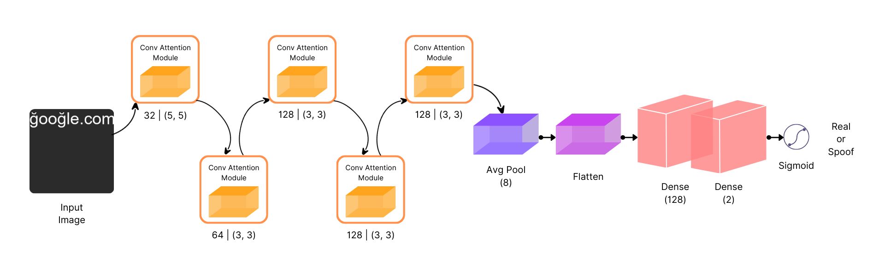

# GlyphNet: Homoglyph domains dataset and detection using attention-based Convolutional Neural Networks

Akshat Gupta, Laxman Singh Tomar, Ridhima Garg

**Abstract**
Cyber attacks deceive machines into believing something that does not exist in the first place. However, there are some to which even humans fall prey. One such famous attack that attackers have used over the years to exploit the vulnerability of vision is known to be a Homoglyph attack. It employs a primary yet effective mechanism to create illegitimate domains that are hard to differentiate from legit ones. Moreover, as the difference is pretty indistinguishable for a user to notice, they cannot stop themselves from clicking on these homoglyph domain names.
In many cases, that results in either information theft or malware attack on their systems. Existing approaches use simple, string-based comparison techniques applied in primary language-based tasks. Although they are impactful to some extent, they usually fail because they are not robust to different types of homoglyphs and are computationally not feasible because of their time requirement proportional to the string's length.
Similarly, neural network-based approaches are employed to determine real domain strings from fake ones. Nevertheless, the problem with both methods is that they require paired sequences of real and fake domain strings to work with, which is often not the case in the real world, as the attacker only sends the illegitimate or homoglyph domain to the vulnerable user. Therefore, existing approaches are not suitable for practical scenarios in the real world. In our work, we created GlyphNet, an image dataset that contains 4M domains, both real and homoglyphs. Additionally, we introduce a baseline method for homoglyph attack detection system using an attention-based convolutional Neural Network. We show that our model can reach state-of-the-art accuracy in detecting homoglyph attacks with a 0.93 AUC on our dataset. 

To address the aforementioned problem,we introduced an unpaired homoglyph attack detection system using a *Convolutional Neural Network*. Our model achieves state-of-the-art in detecting in domain spoof homoglyphs and process spoof homoglyphs showing 0.93 AUC and 0.98 AUC respectively.

All data files under /data

#### Directory structure of data folder 

│   train

      -real
      -phish
│   valid

      -real
      -phish
│   test

      -real
      -phish

All notebook files under /notebooks

All script files under /code

All model files under models/


## Dependencies

You'll need a working Python environment to run the code. This repo is based on <b>Tensorflow</b>, <b>Keras</b>.
You can install the requirements using 

```pip install -r requirements.txt```

If you will train it on GPU. You need to explicity install ```pip install tensorflow-gpu```

## Process to run 

### Data generation

#### GlyphNet
We have proposed a dataset consisting of real and homoglyph domains. In order to generate homoglyph domains,
real domains are needed. We have obtained domains from the Domains Project(Turkynewych 2020). This repository
is one of the largest collections of publicly available active domains. The entire repository comprises 500M domains,
and we restricted our work to 2M domains due to hardware restrictions.

1. Run dataGeneration.py to prepare the data which will create a CSV. It accepts an path argument for data.
It uses domains_final.txt which is already present in the data folder.

   - ``python code/dataGeneration.py --path_data <path_for_data>``

   
2. Run ImageGeneration.py to create images from CSV file created at step 1. It will create directories of real and fake in the dataset folder.

    - ``python code/ImageGeneration.py --path_data <path_for_data>``
   

3. Run dataSplit.py to to split the data into train, val, test.

    - ``python code/dataSplit.py --path_data <path_for_data>``

Images will look like this -:


**_Note_** -: You can also directly use th dataset present in our assets<link> if you dont want to generate from scratch.
You can modify the script in ImageGeneration.py, if you want to generate different/extend data.

### Model


#### Training the model

The rendered images are then used as input to the CNN to learn the desired visual feature information. The model consists of four Conv2D layers to learn visual information such
as edges, curves, and strokes. Each convolutional layer is paired with a max-pooling layer to perform dimensionality
reduction on the learned features. This model is developed in keras. Each convolution block is followed by CBAM attention



#### Experimental Settings
For the training part, we used binary cross-entropy as a Loss Function. We have used RMSProp Optimizer to optimize the
loss obtained from the binary cross-entropy loss function, with a learning rate of 10e −4 , and the network is trained
for 30 epochs with early stopping. We trained with a batch size of 256.

- Run the train.py

```python train.py```

**_Note_** -: If you wish to use our model for your custom data, you can do it easily by maintaining the directory
[structure for the data](#directory-structure-of-data-folder).


## License


